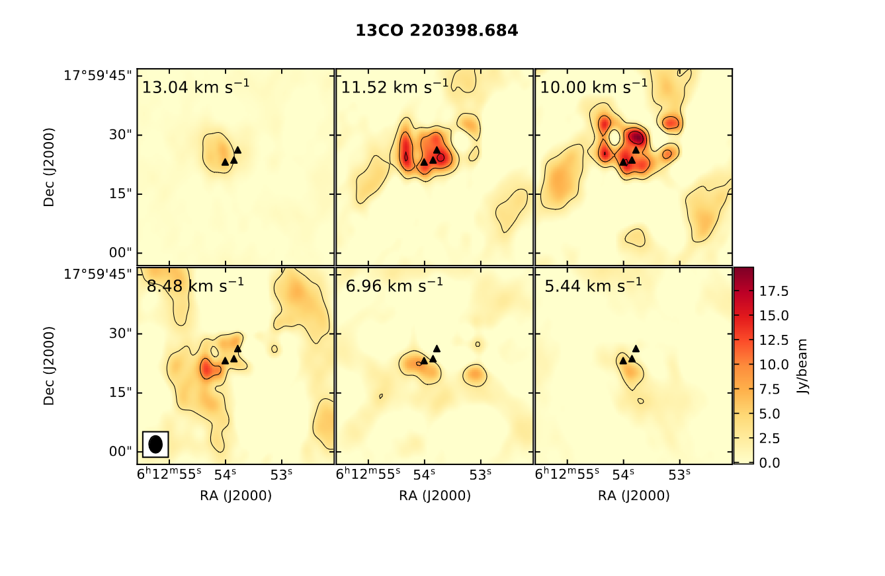

# S255IR data processing

The file and folder structure here differs from the one on my computer, which should affect the file addresses in the code. 

## Channel maps

Here is Python script "channel_map.py" to plot a channel map from a fits file (3D data cube) with aplpy library.

This is just an example of how you can build a channel map using features supported in 2024. Before writing this code, I found only examples that modern Python no longer supports.

If you are using CASA software and have a filename.image file, fits file can be created with CARTA (save image -> fits format (do not forget to click on "Drop degenerative axes"))

## Customized scripts

Those are actual scripts that I use for plotting and data processing.

### file_processing

This is for dividing continuum and line images, changing fits file header, running similar class commands (for a large number of files) and creating spectrum file.

### get_html_database

This is to reach [online Rest Frequencies database by Frank J. Lovas](https://pml.nist.gov/cgi-bin/micro/table5/start.pl) by script, so you don't have to do it manually many times. But the method is obviously a crutch, so far I haven't figured out how to do it properly.

### plotting_channel_map

Plots many channel maps for every line in a ods table.
Columns in my table:

1. Variant part of the data file name,
2. rounded frequency version 1 (not used in codes, this is for initial viewing)
3. relative intensity (not used in codes, this is for initial viewing),
4. rounded frequency version 2 (for map file names)
5. frequency
6. Molecule
7. Velocity (not used in codes)
8. first channel of the channel map
9. last channel (not used in codes)
10. number of channels (if it's not 3, 6, 9... change 'rows' in the codes)
11. rows (not used in codes)

### plotting_integrated_map

Plots maps of integrated intensity. Works pretty similar to channel map code. 

### plotting_map_set

Plots integrated maps for different molecules or lines. Require fits file created after code in plotting_integrated_map. Reminder: I need to fix this one since I've changed the table a bit.

### source_sizes
There is a script to create commands for casa 2D fitting, a script to get data from a text file created by casa and a bash script created by 'commands_for_sizes.py' to run in the terminal.

### my_functions.py
A mini library with functions that I use in those codes.
